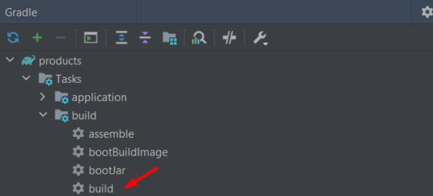
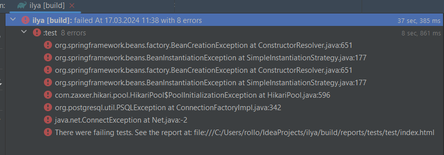
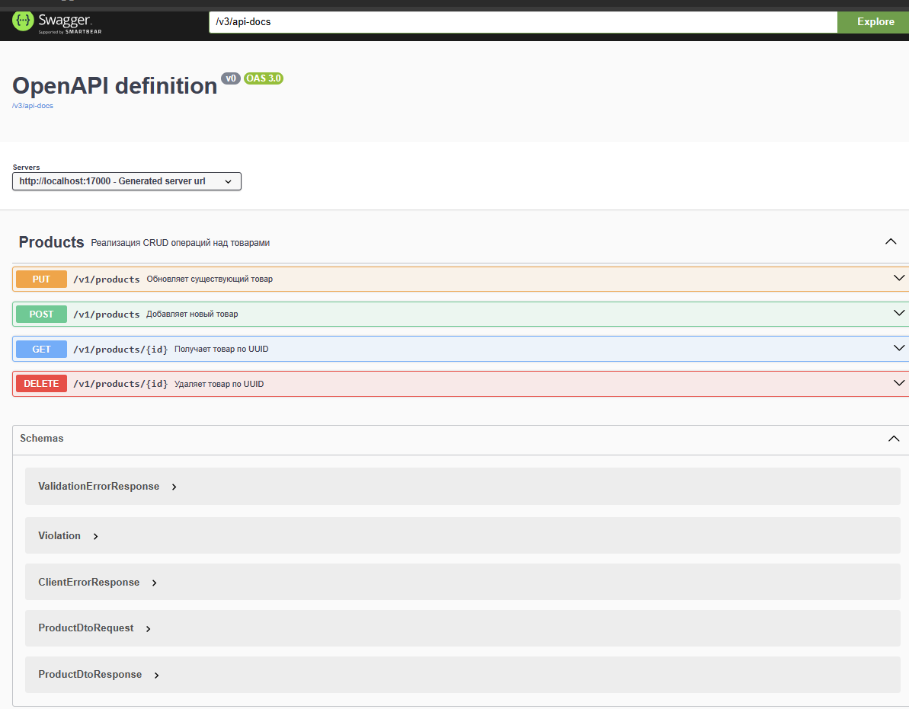
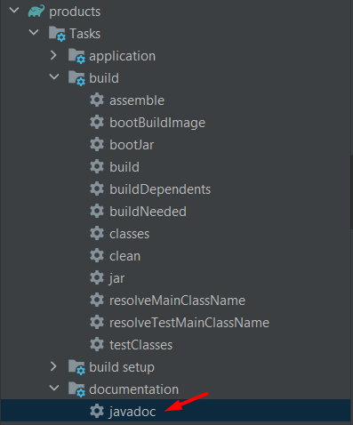
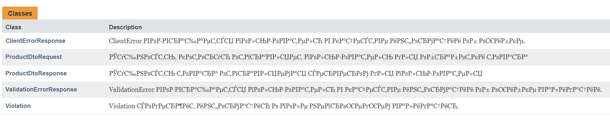
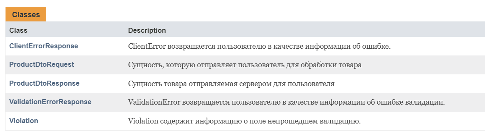

# Products CRUD app

1. [Запуск в idea](#Запуск-в-idea)
2. [Запуск в docker](#Запуск-в-docker)
3. [Ошибки в test во время сборки](#Ошибки-в-test-во-время-сборки)
4. [Открытие Swagger](#Открытие-swagger)
5. [HTTP запросы и Postman коллекция запросов](#http-запросы-и-postman-коллекция-запросов)
6. [Тесты на сервисный слой](#Тесты-на-сервисный-слой)
7. [Генерация javaDoc](#Генерация-javadoc)

## Запуск в idea

Для запуска в IntelliJ IDEA нужно клонировать этот репозиторий.
Затем проверить в файле [application.yml](src/main/resources/application.yml)
что активный профиль это `dev` и с помощью вспомогательного окна gradle
запустить build проекта.

После этого нужно запустить Docker. (Контейнер с базой
данных поднимется автоматически при запуске приложения)

Приготовления завершены. Теперь можно запустить приложение.

> [!WARNING]
> Для базы данных требуется порт 5432 так что он должен быть свободным.

## Запуск в docker

Для того чтобы запустить приложение в Docker нужно клонировать этот репозиторий.
В файле [application.yml](src/main/resources/application.yml) указать активный
профиль `container` и с помощью вспомогательного окна gradle запустить build проекта.

После этого запускаем Docker. Переходим к этому [файлу](container/docker-compose.yml)
по пути от корня проекта `./container/docker-compose.yml`. Запускаем и теперь у нас
создался докер контейнер с нашим приложением и базой данных.

> [!WARNING]
> Для базы данных требуется порт 5432, а для приложения 17000. Они должны быть свободными.

## Ошибки в test во время сборки

При сборке проекта могут возникнуть такие ошибки:

Это связано с тем, что невозможно установить соединение с базой данных
(т.к. она отсутствует), но при запуске приложения база данных сама создается
и заполняется с помощью `Flyway migrations`, так что на эти ошибки можно не
обращать внимание. На работоспособность приложения они не влияют.

## Открытие Swagger

После успешного запуска приложения можно перейти к Swagger'y. Для этого
нужно открыть [эту ссылку](http://localhost:17000) или перейти в браузере
по `http://localhost:17000`.

Теперь можно взаимодействовать со Swagger.

## HTTP запросы и Postman коллекция запросов

В этой [папке](http) содержатся http запросы и postman коллекция.

## Тесты на сервисный слой

В этой [папке](src/test/java/com/ilya/products/services/impl) содержится класс с
тестами на сервисы с использованием `JUnit 5` и `Mockito`.

## Генерация javaDoc

Для получения документации нужно в меню gradle нажать на:

Тогда в папке build будет создан подкаталог docs, в котором если
открыть файл `index.html` через браузер, то можно будет просматривать
документацию.

> [!WARNING]
> Если в документации есть подобные ошибки кодировки:
>
> 
>
> То нужно сделать следующее:
> В Windows перейти в `Панель управления` -> `Часы и регион` -> `Региональные стандарты`
> в окне `регион` перейти по вкладке `дополнительно` в блоке `Язык программ, не поддерживающих Юникод`
> выбрать `Изменить язык системы` в вновь открывшемся окне поставить
> галочку на пункт `Использовать Юникод (UTF-8) для поддержки языка во всем мире`
> после этого компьютер перезагрузится. Пересоберите документацию с помощью gradle.
> После этих манипуляций документация должна отображаться корректно.
>
> 

